# Операционные системы UNIX/Linux (Базовый).

## Part 1. Установка ОС

- Вывод информации о версии системы.
> 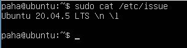

## Part 2. Создание пользователя

- Создание пользователя с указанием имени, с созданием каталога, с указанием командной оболочки и с добавлением его в группу adm. После установим для него пароль.
> 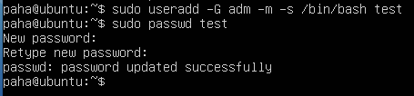

- Вывод файла /etc/passwd
> 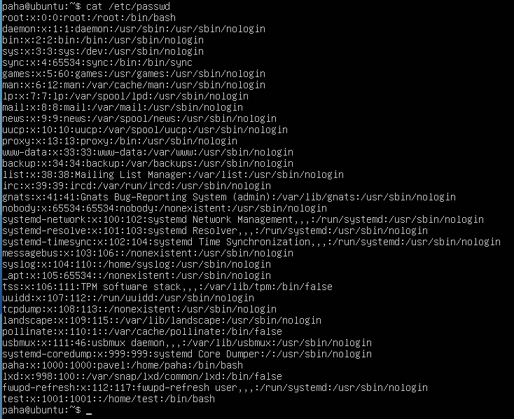

## Part 3. Настройка сети ОС

- Зададим название машины.
> 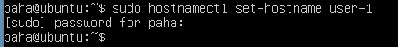

- Так-же пропишем это имя в файле /etc/hosts, вызвав команду sudo vi /etc/hosts
> 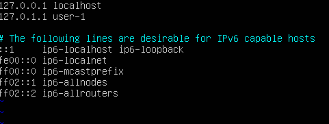

- Установка временной зоны.
> 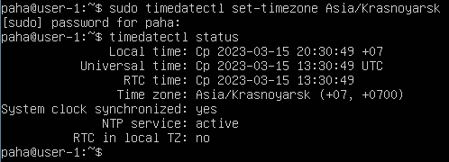

- Вывод названия сетевых интерфейсов. 
> 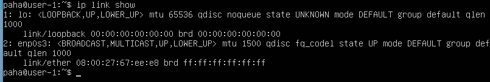

lo (loopback device) – виртуальный интерфейс, присутствующий по умолчанию в любом Linux. Он используется для отладки сетевых программ и запуска серверных приложений на локальной машине. С этим интерфейсом всегда связан адрес 127.0.0.1. У него есть dns-имя – localhost.

- Получение ip-адрес устройства от DHCP-сервера. 
> 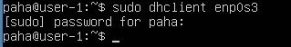

DHCP — Dynamic Host Configuration Protocol — протокол динамической настройки узла.

- Определим ip-адрес шлюза — 10.0.2.15, внутренний ip-адрес шлюза — 10.0.2.2
> 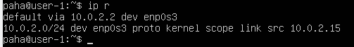

- Зададим статичные настройки ip, gw и dns. Для этого отредактируем файл /etc/netplan/00-installer-config.yaml
> 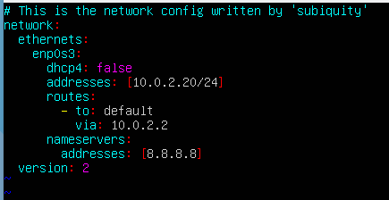

- Для приминения настроек сети и перезагрузки введем следующие команды.
> 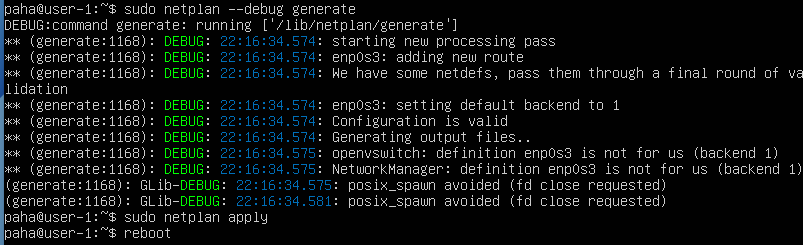

- После перезагрузки проверим настройки.
> 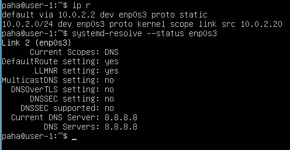

- Пропингуем хосты ya.ru и 1.1.1.1
> 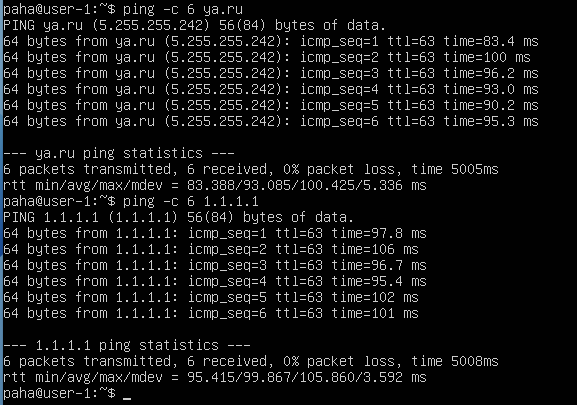

## Part 4. Обновление ОС

- Обновление системы. После обновления попытаемся снова обновить.
> 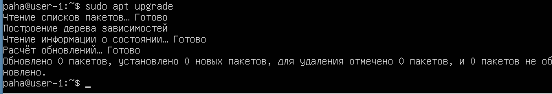

## Part 5. Использование команды **sudo**

- Разрешим пользователю test выполнять команду sudo.
> 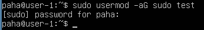
  
- Поменяем hostname от имени пользователя test. Сразу выведем изменненный hostname.
> 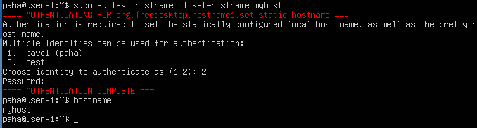

Sudo– это утилита, позволяющая пользователю запускать программы с привилегиями другой учётной записи, как правило, суперпользователя.

## Part 6. Установка и настройка службы времени

- Настроим службу автоматической синхронизации времени и выведем отчет.
> 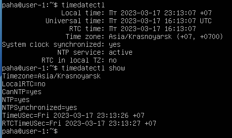

## Part 7. Установка и использование текстовых редакторов 

- Создание и редактирование файла test_vim.txt с помощью редактора vim. Для выхода с сохранением сначала выходим из режима вставки, нажав Esc, потом вводим последовательность :wq и Enter.
> 

- Создание и редактирование файла test_nano.txt с помощью редактора nano. Для выхода с сохранением вводим Ctrl+X, потом Y на запрос о сохранении, затем Enter.
> 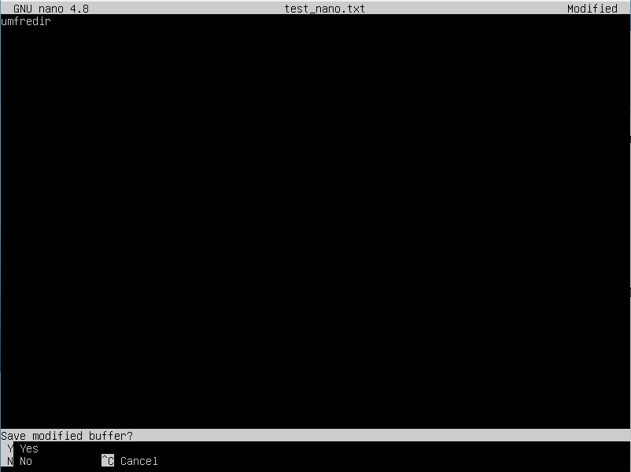

- Создание и редактирование текстового файла с помощью редактора mcedit. Для выхода сохраняем, нажав F2 и Enter, потом выходим клавишей F10.
> 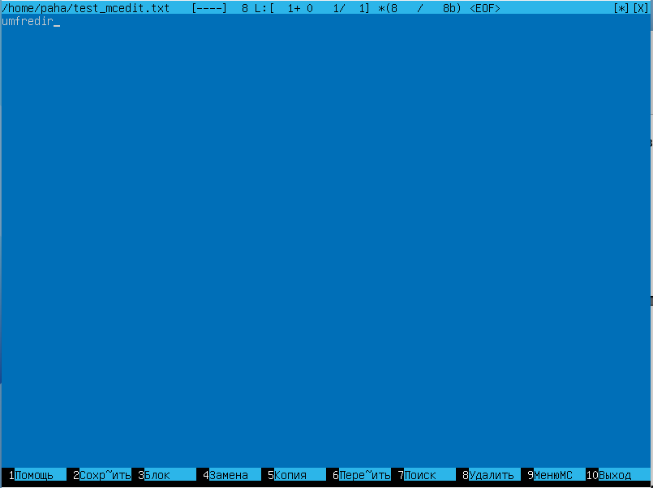

- Редактирование файла с помощью редактора vim. Для выхода без сохранения сначала выходим из режима вставки, нажав Esc, потом вводим последовательность :q! и Enter.
> 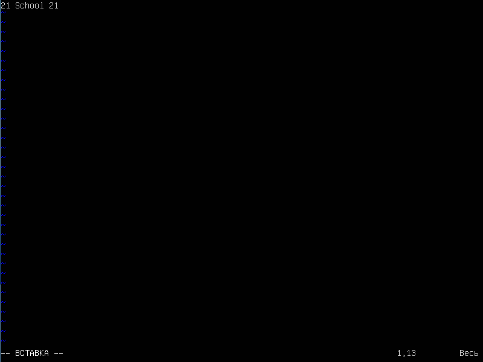

- Редактирование файла с помощью редактора nano. Для выхода без сохранения нажимаем CTRL+X, затем N.
> 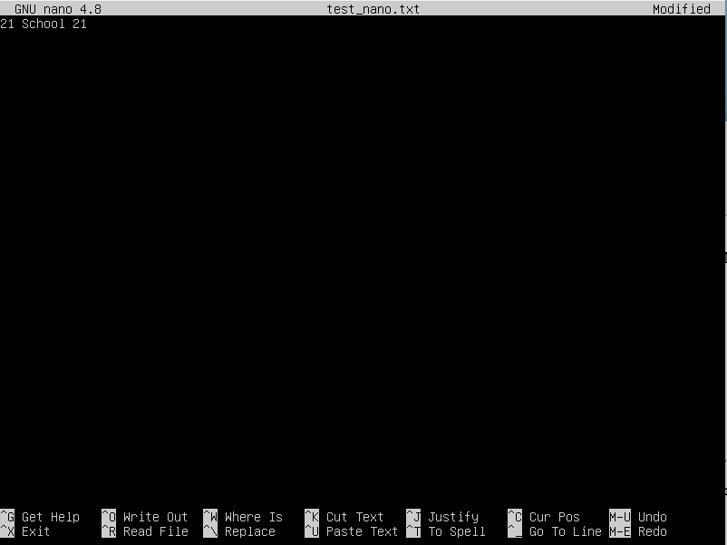

- Редактирование файла с помощью редактора mcedit. Для выхода без сохранения нажимаем F10, затем на запрос о сохранении клавишами курсора выбираем "Нет" и нажимаем Enter.
> 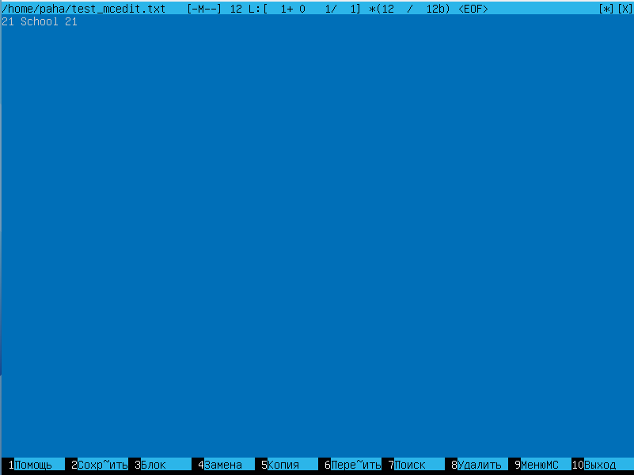

- Поиск в редакторе vim. Для поиска слова School вводим следующие команды.
> 

- Поиск и замена в редакторе vim. Для замены слова School на College вводим следующие команды.
> 

- Результат замены в vim.
> 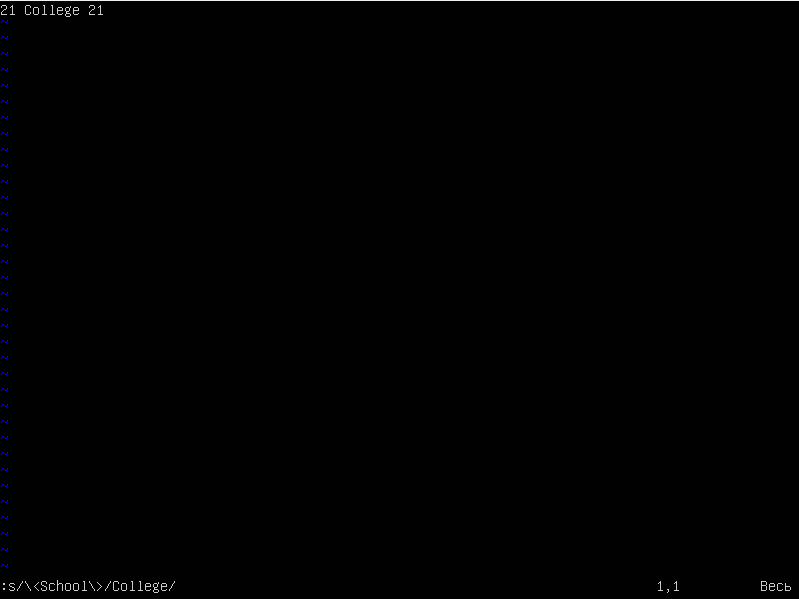

- Поиск в редакторе nano. Для поиска слова School нажимаем CTRL+W, затем, если после Search не видно [Regexp], нажимаем ALT+R, вводим следующую команду и нажимаем Enter.
> 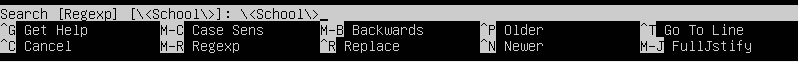

- Результаты поиска в nano.
> 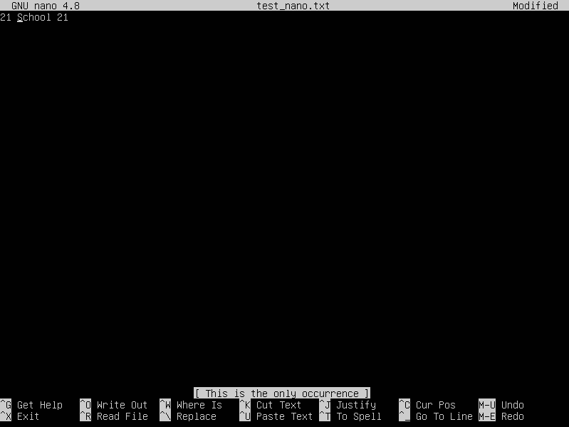

- Поиск и замена в редакторе nano. Для замены слова School на College нажимаем CTRL+W, затем, если после Search не видно [Regexp], нажимаем ALT+R, потом нажимаем CTRL+R, вводим следующую команду и нажимаем Enter.
> 

- Далее вводим College и  нажимаем Enter.
> 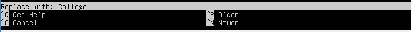

- И жмем Y на вопрос о замене.
> 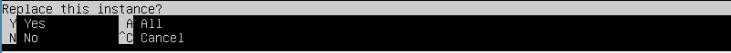

- Результат замены в nano.
> 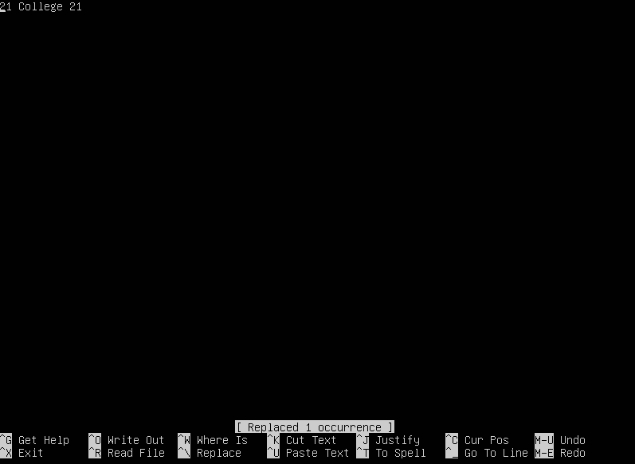

- Поиск в редакторе mcedit. Для поиска слова School нажимаем F7, далее вводим в строке поиска School, с помощью курсорных клавиш перемещаемся к "Слово целиком", отмечаем пробелом, перемещаемся к "Далее" и жмем Enter.
> 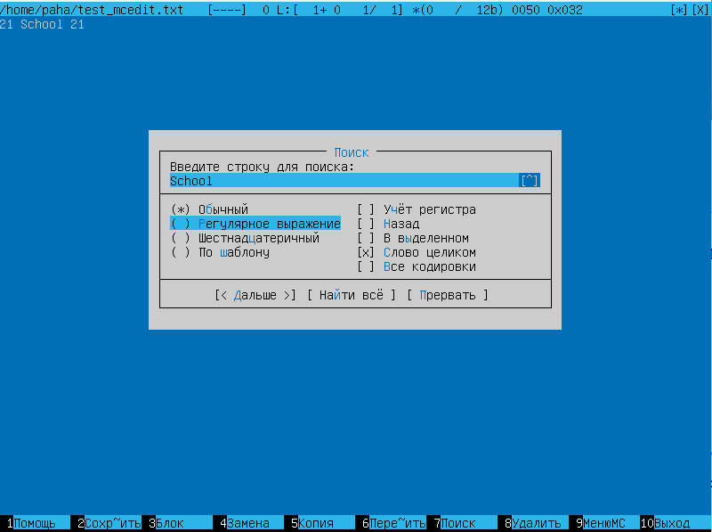

- Результат поиска в mcedit.
> 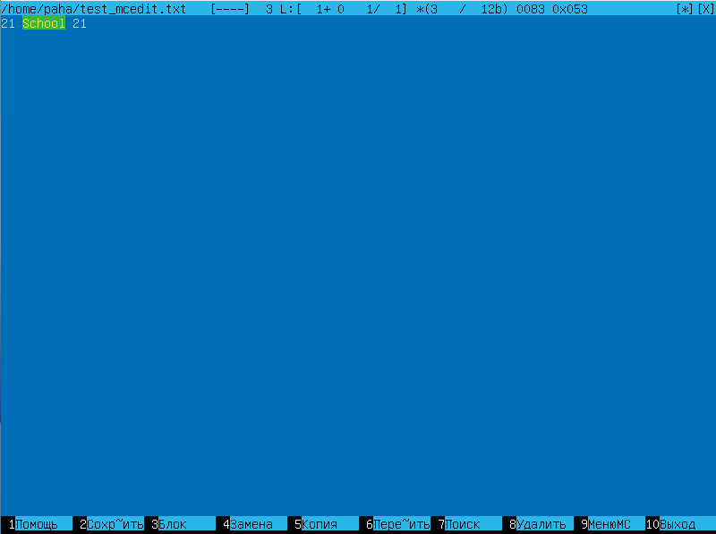

- Поиск и замена в редакторе mcedit. Для замены слова School на College нажимаем F4, далее вводим в строке поиска School. В строке замены вводим College. Далее с помощью курсорных клавиш перемещаемся к "Слово целиком", отмечаем пробелом, перемещаемся к "Далее" и жмем Enter.
> 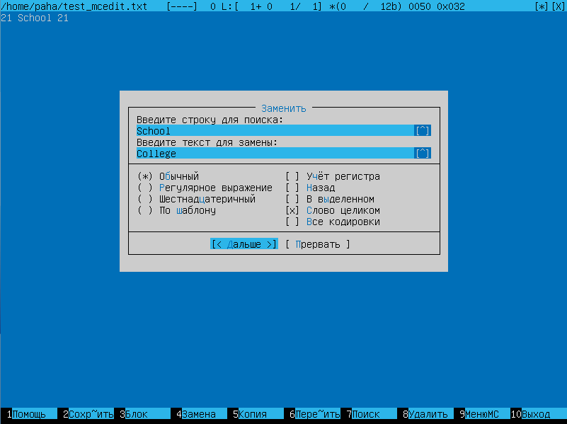

- Тут выбираем "Заменить" и жмем Enter.
> 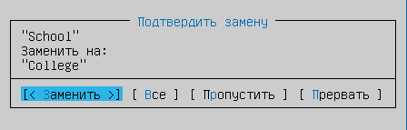

- Результат замены в mcedit.
> 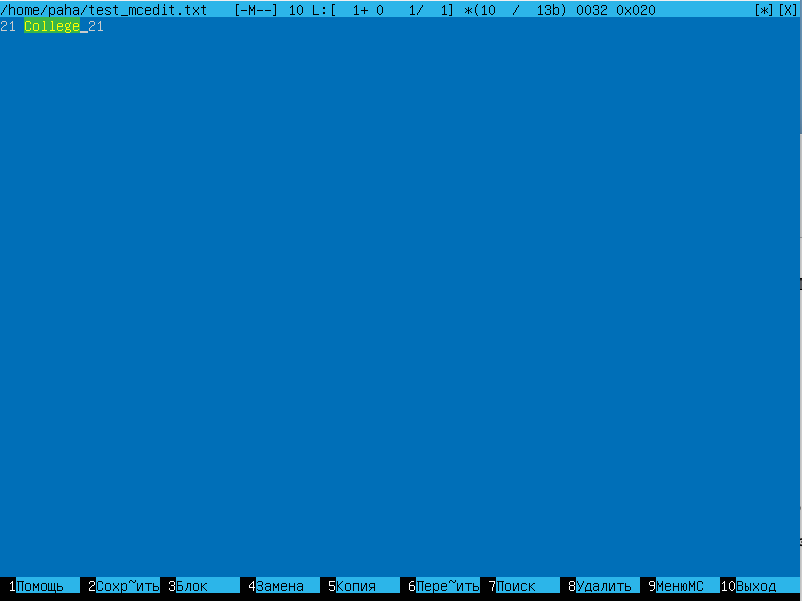

## Part 8. Установка и базовая настройка сервиса **SSHD**

- Установка службы SSHd.
> 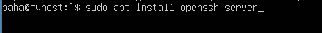

- Добавим автостарт службы SSHd при загрузке ОС.
> 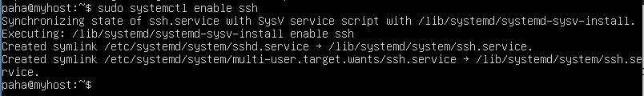

- Перенастроим службу sshd на порт 2022. Для этого отредактируем файл /etc/ssh/sshd_config
> 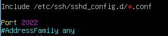

- Проверим наличие процесса sshd командой ps -C sshd. Команда ps выводит список процессов. -C ключ команды ps означает вывести запущенные процессы по указанному имени.
> 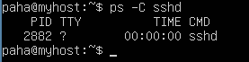

- Перезагрузим систему с помощью команды reboot.

- Отчет команды netstat -tan
> 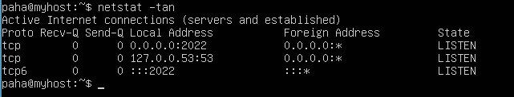

- Ключи команды netstat:

  - -t — вывод только tcp соединений.

  - -a — Показывать состояние всех соединений; обычно соединения, используемые серверными процессами, не показываются.

  - -n — отключить преобразование ip адреса в имя компьютера.

- Выводимые поля для интернет соединений:

  - Proto – протокол (tcp, udp).

  - Recv-Q – количество байтов, помещённых в буфер приёма TCP/IP, но не переданных приложению.

  - Send-Q – количество байтов, помещённых в буфер отправки TCP/IP, но не отправленных, или отправленных, но не подтверждённых.

  - Local Address – локальный адрес сервера. В обычных соединения, это адрес сервера на который пришло соединение. В прослушиваемых портах (LISTEN) – это диапазон адресов. Так 0.0.0.0:port – значит подключаться можно ко всем адресам сервера, а 192.168.0.35:port – значит подключаться можно только к этому адресу сервера.

  - Foreign Address – адрес второй стороны. В обычных соединения, это адрес с которого пришло соединение. В прослушиваемых портах (LISTEN) – это диапазон адресов. Так 0.0.0.0:\* – значит подключаться можно с любых адресов и с любых портов, а например 192.168.0.50:\* – значит подключаться можно только с этого адреса и с любых портов.

  - State – состояние подключения или прослушивания.

## Part 9. Установка и использование утилит **top**, **htop**

- Вывод команды top.
> 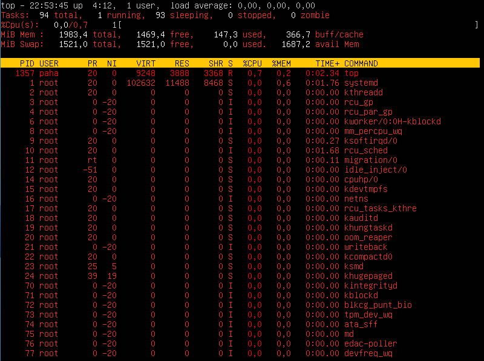

- Разберем вывод:

  - Uptime: 3:59

  - Количество авторизованных пользователей - 1

  - Общая загрузка системы за последние 1, 5, 15 минут: 0,00, 0,00, 0,00

  - Общее количество процессов: 95

  - Загрузка CPU: 1%

  - Загрузка памяти: 147,3 MiB

  - PID процесса, занимающего больше всего памяти: 658

  - PID процесса, занимающего больше всего процессорного времени: 1357

- htop. Сортировка по PID.
> 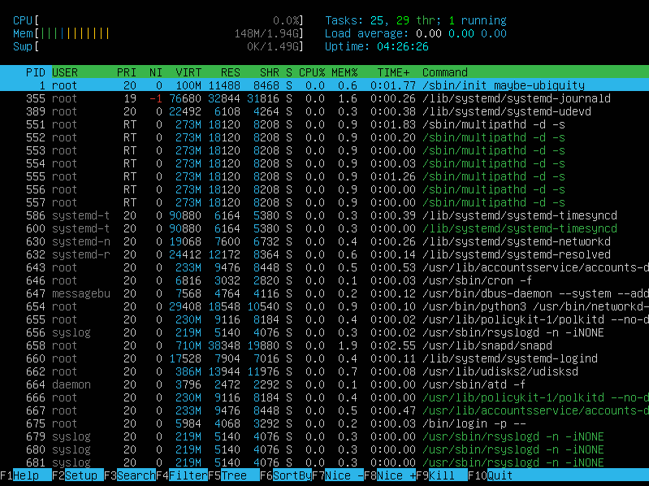

- htop. Сортировка по PERCENT_CPU.
> 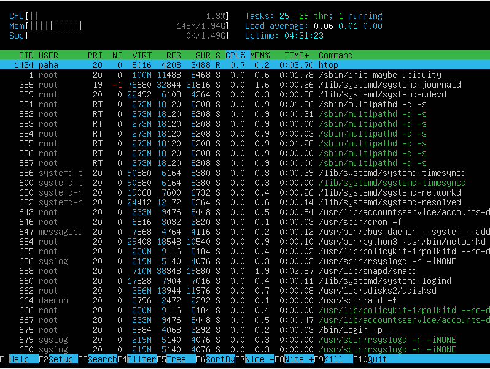

- htop. Сортировка по PERCENT_MEM.
> 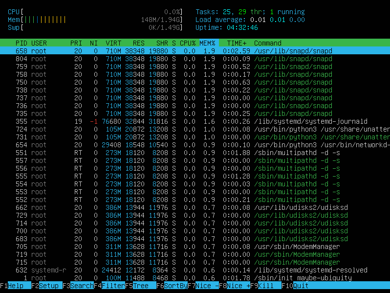

- htop. Сортировка по TIME.
> 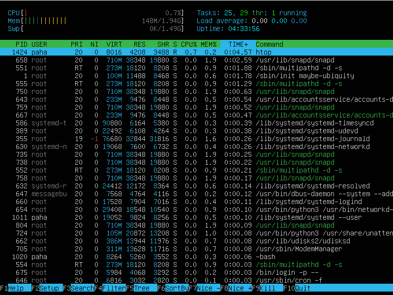

- htop. Фильтр для процесса sshd.
> 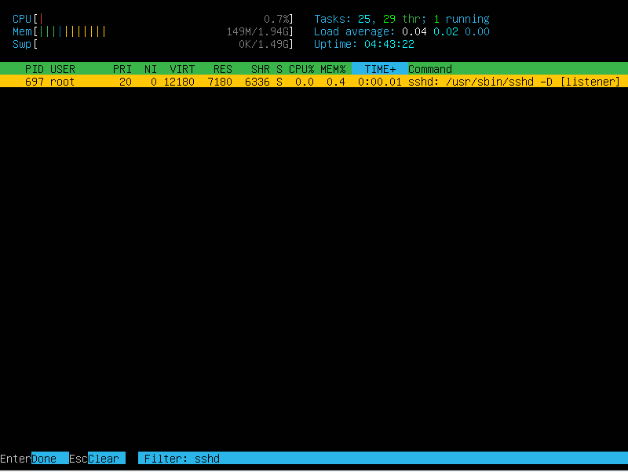

- htop. Поиск процесса syslog.
> 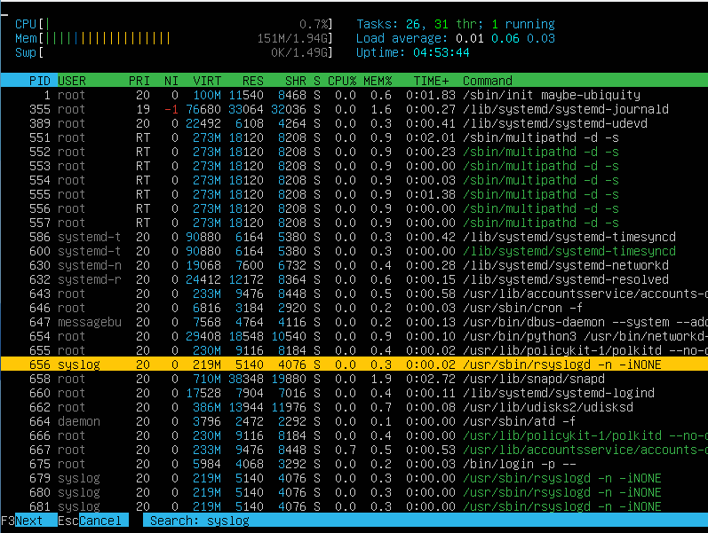

- htop с добавленным выводом hostname, clock и uptime.
> 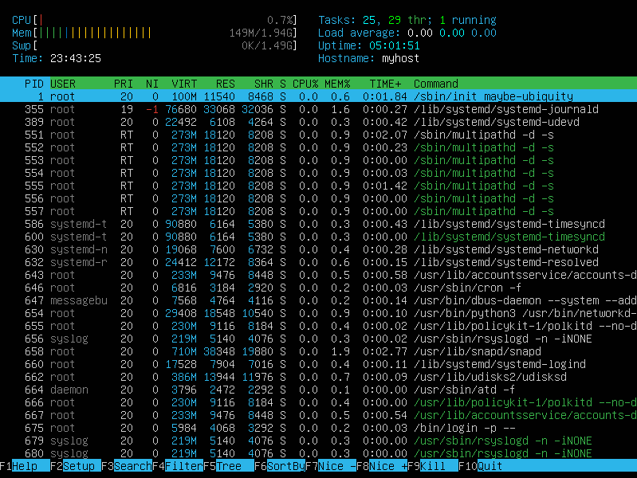

## Part 10. Использование утилиты **fdisk**

- Вывод команды fdisk -l
> 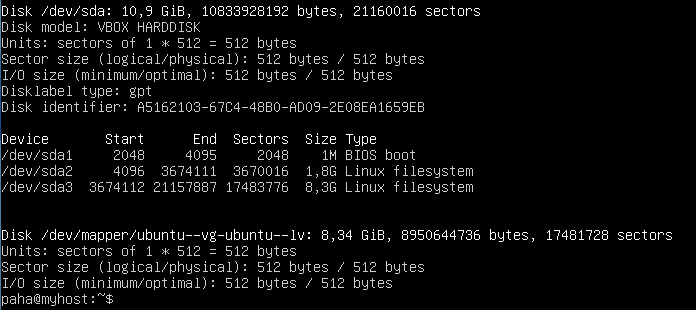

- Разберем вывод fdisk:

  - Жесткий диск: VBOX HARDDISK

  - Объём: 10.9 GiB

  - Количество секторов: 21160016

  - Размер Swap: Раздел Swap отсутствует

## Part 11. Использование утилиты **df** 

- Вывод команды df
> 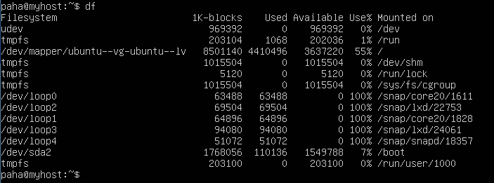

- Разберем вывод df:

  - Размер корневого раздела: 8501140

  - Размер занятого пространства корневого раздела: 4410496

  - Размер свободного пространства корневого раздела: 3637220

  - Процент использования корневого раздела: 55

  - Единица измерения: Килобайты

- Вывод команды df -Th
> 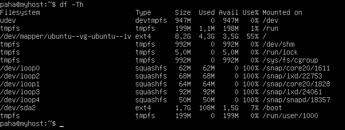

- Разберем вывод df -Th

  - Размер корневого раздела: 8,2 GB

  - Размер занятого пространства корневого раздела: 4,3 GB

  - Размер свободного пространства корневого раздела: 3,5 Gb

  - Процент использования корневого раздела: 55

  - Тип файловой системы корневого раздела: ext4

## Part 12. Использование утилиты **du**

- Вывод размеров папок /home /var в байтах с помощью команды du
> 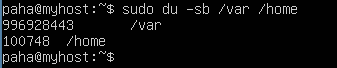

- Вывод размера папки /var/log в байтах с помощью команды du
> 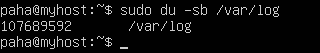

- Вывод размеров папок /home /var в человекочитаемом виде с помощью команды du
> 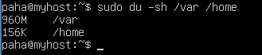

- Вывод размера папки /var/log в человекочитаемом виде с помощью команды du
> 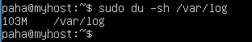

- Вывод размеров каждого вложенного элемента в /var/log. Вводим команду sudo du -h /var/log/*
> 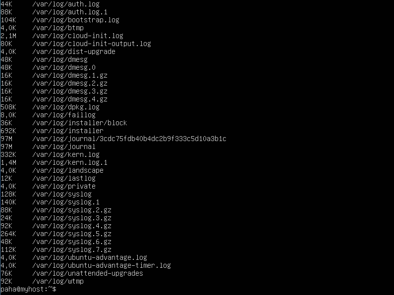

## Part 13. Установка и использование утилиты **ncdu**

- Вывод размеров папок /home /var с помощью команды ncdu /. Видим, что /home занимает 156 KiB, а /var занимает 956,4 MiB.
> 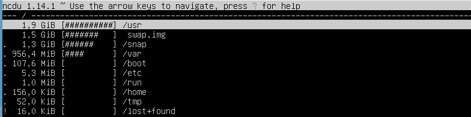

- Вывод размера папки /var/log с помощью команды ncdu /var. Видим, что /var/log занимает 102,6 MiB.
> 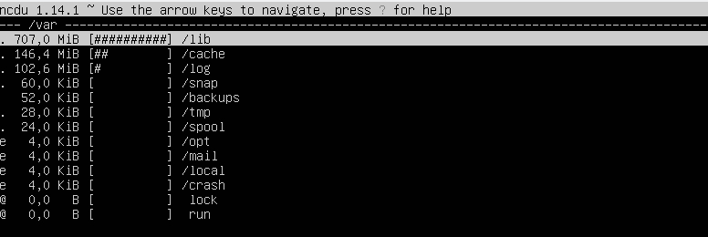

## Part 14. Работа с системными журналами

- Время последней успешной авторизации: 20:05:19. Имя полльзователя: paha. Метод входа в систему: Локальный вход посредством  systemd-logind.
> 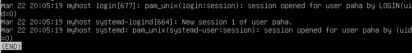

- Перезапустим службу sshd. Найдем отчет об этом в файле /var/log/syslog
> 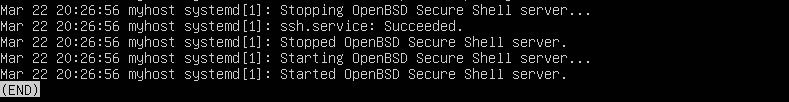

## Part 15. Использование планировщика заданий **CRON**

- Список текущих задач выводится командой crontab -l
> 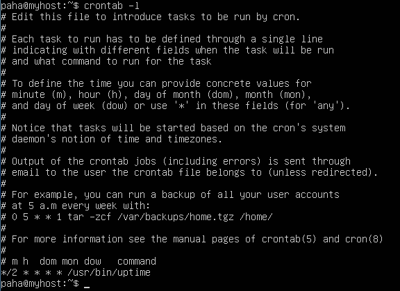

- Находим в файле /var/log/syslog отчет о выполнении задач.
> 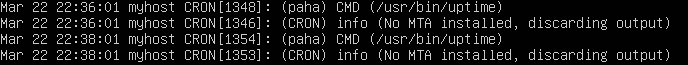

- Очищаем планировщик заданий и проверяем его.
> 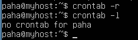

