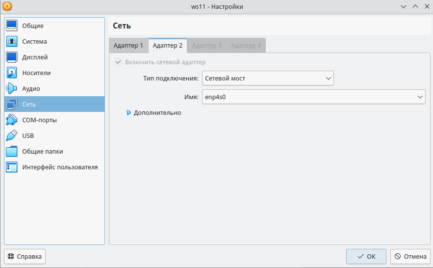
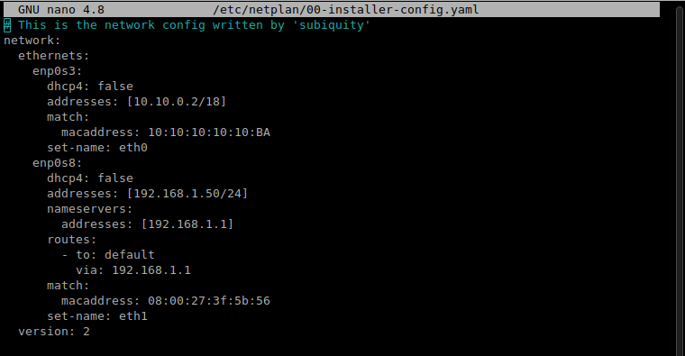
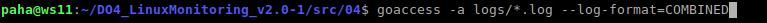
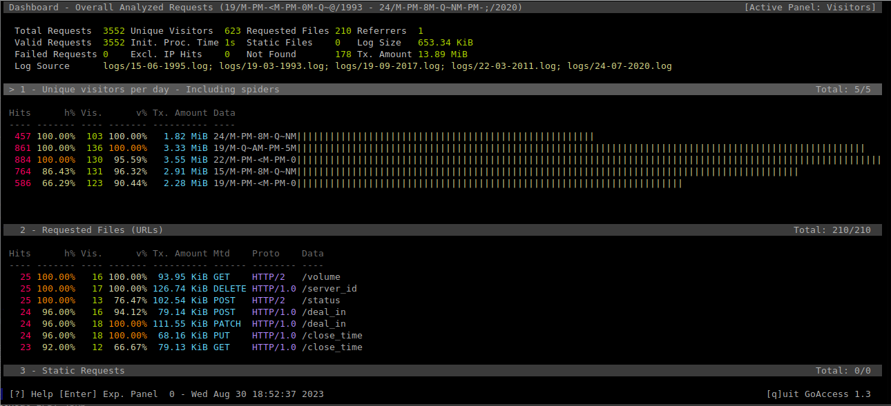
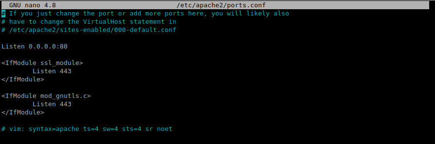
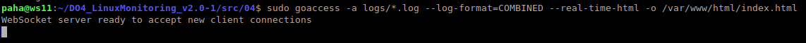
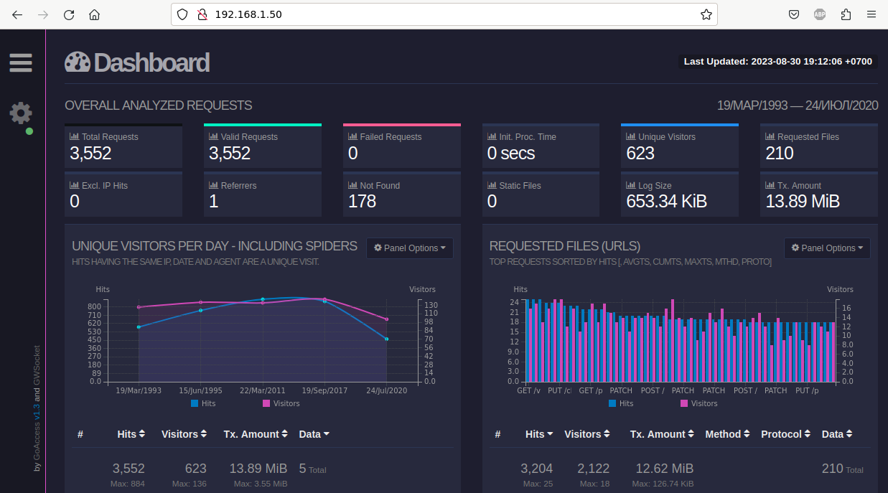

# Отчёт по установке и использованию GoAccess

### Настром сеть на виртуальной машине следующим образом





Таким образом из host-машины будем обращаться к виртуальной машине по адресу 192.168.1.50

### Установка и запуск GoAccess:
```
$ sudo apt install goaccess
$ goaccess -a logs/*.log --log-format=COMBINED
```
_Запуск GoAccess:_ \


_Вывод GoAccess:_ \


### Установка веб-сервера Apache2
`$ sudo apt install apache2`

### Настройка Apache2

_/etc/apache2/ports.conf_ \


### Перезапуск Apache2
`$ sudo service apache2 restart`

### Запуск GoAcces в режие html
`$ sudo goaccess -a logs/*.log --log-format=COMBINED --real-time-html -o /var/www/html/index.html`



### Просмотр страницы GoAcces на host-машине
