# Отчёт по установке и использованию Prometheus and Grafana

### Настром сеть на виртуальной машине следующим образом

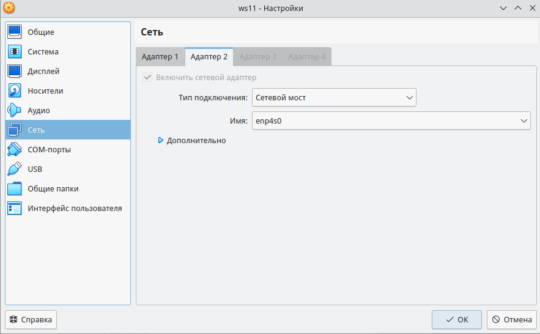

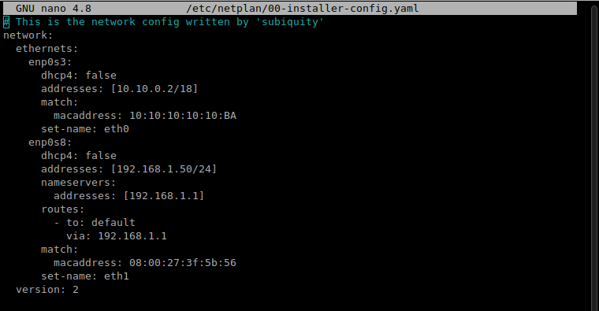

Таким образом из host-машины будем обращаться к виртуальной машине по адресу 192.168.1.50

## Prometheus

### Установка Prometheus:

```
$ sudo useradd --system --no-create-home --shell /bin/false prometheus
$ wget https://github.com/prometheus/prometheus/releases/download/v2.37.9/prometheus-2.37.9.linux-amd64.tar.gz
$ tar xf prometheus-2.37.9.linux-amd64.tar.gz
$ sudo mkdir -p /etc/prometheus /var/lib/prometheus
$ cd prometheus-*
$ sudo mv prometheus promtool /usr/local/bin/
$ sudo mv prometheus.yml /etc/prometheus
$ sudo chown -R prometheus:prometheus /etc/prometheus/ /var/lib/prometheus
$ prometheus --version
```


### Создание systemd юнита:

`$ sudo nano /etc/systemd/system/prometheus.service`

_prometheus.service:_

```
[Unit]
Description=Prometheus
Wants=network-online.target
After=network-online.target

[Service]
User=prometheus
Group=prometheus
Type=simple
Restart=on-failure
RestartSec=5s
ExecStart=/usr/local/bin/prometheus \
  --config.file=/etc/prometheus/prometheus.yml \
  --storage.tsdb.path=/var/lib/prometheus/

[Install]
WantedBy=multi-user.target
```

### Запуск Prometheus:

```
$ sudo systemctl daemon-reload
$ sudo systemctl enable prometheus
$ sudo systemctl start prometheus
$ sudo systemctl status prometheus
```

_Веб-интерфейс Prometheus по адресу 192.168.1.50:9090_ \
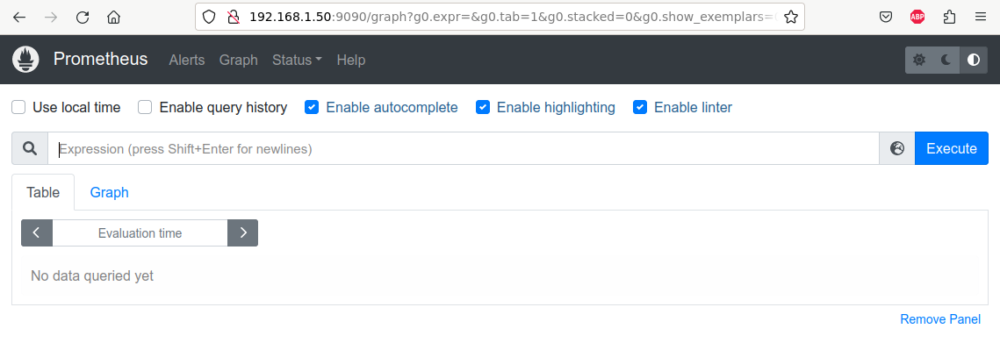

## Node Exporter:

### Установка Node Exporter:

```
$ sudo useradd --system --no-create-home --shell /bin/false node_exporter
$ wget https://github.com/prometheus/node_exporter/releases/download/v1.6.1/node_exporter-1.6.1.darwin-amd64.tar.gz
$ tar xf node_exporter-1.6.1.linux-amd64.tar.gz
$ sudo mv node_exporter-1.6.1.linux-amd64/node_exporter /usr/local/bin/
$ rm -rf node_exporter*
$ node_exporter --version
```

### Создание systemd юнита Node Exporter:

`$ sudo nano /etc/systemd/system/node_exporter.service`

_node_exporter.service:_

```
[Unit]
Description=Node Exporter
Wants=network-online.target
After=network-online.target

StartLimitIntervalSec=500
StartLimitBurst=5

[Service]
User=node_exporter
Group=node_exporter
Type=simple
Restart=on-failure
RestartSec=5s
ExecStart=/usr/local/bin/node_exporter \
    --collector.logind

PrivateTmp=yes
ProtectHome=yes
NoNewPrivileges=yes

ProtectSystem=strict
ProtectControlGroup=true

[Install]
WantedBy=multi-user.target
```

### Запуск Node Exporter:

```
$ sudo systemctl daemon-reload
$ sudo systemctl enable node_exporter
$ sudo systemctl start node_exporter
$ sudo systemctl status node_exporter
```

### Настройка Prometheus для связывания его с Node Exporter:

`$ sudo nano /etc/prometheus/prometheus.yml` 

_Допишем в файл prometheus.yml в раздел scrabe_configs следующие строки:_

```

...

scrabe_configs:

...

  - job_name: "node_export"
    static_configs:
      - targets: ["localhost:9100"]
```

_Таргеты в веб-интерфейсе Prometheus:_ \
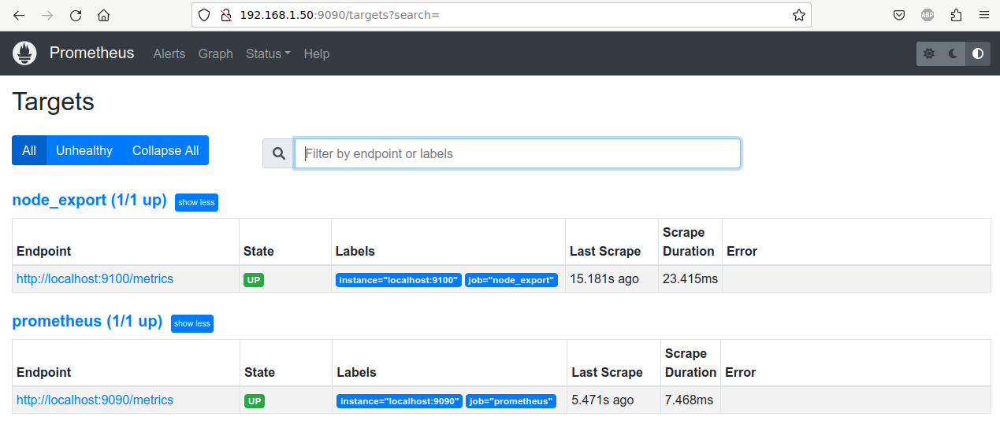


## Установка Grafana:

```
$ sudo apt-get install libfontconfig1
$ wget https://dl.grafana.com/enterprise/release/grafana_8.3.4_amd64.deb
$ sudo dpkg -i grafana_8.3.4_amd64.deb
```

### Запуск Grafana:

```
$ sudo systemctl enable grafana-server
$ sudo systemctl start grafana-server
$ sudo systemctl status grafana-server
```

_Веб-интерфейс Grafana_ \
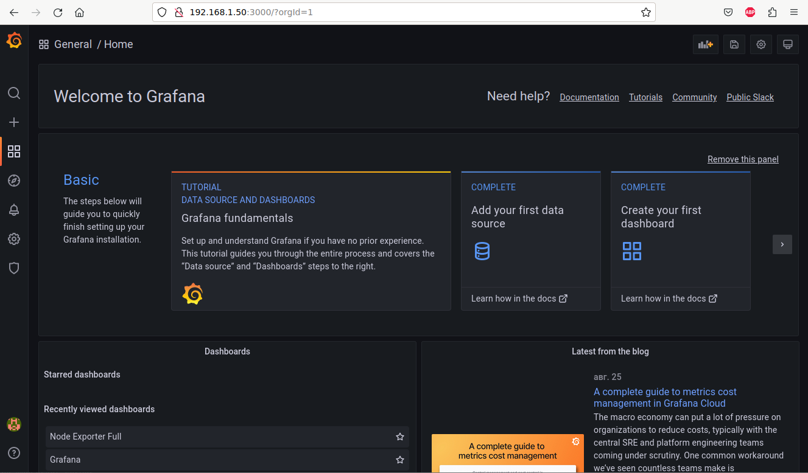

_В настройках Grafana, вкладка Datasource, добавляем наш Prometheus_ \
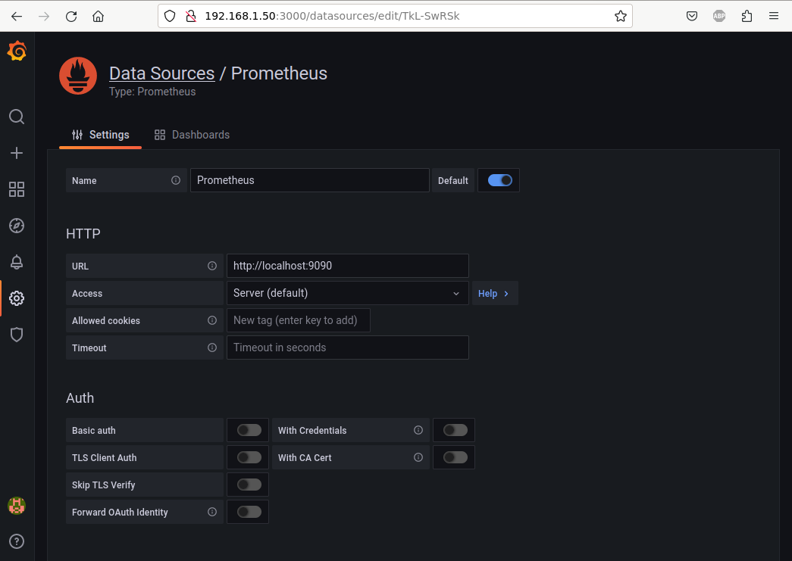 

### Создание дашборда.

_Создадим новый дашборд. Добавим на него отображение отображение ЦПУ, доступной оперативной памяти, свободное место и кол-во операций ввода/вывода на жестком диске:_ \
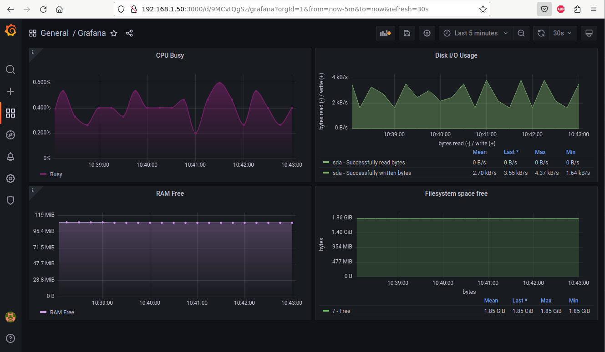

_Пример для CPU:_ \
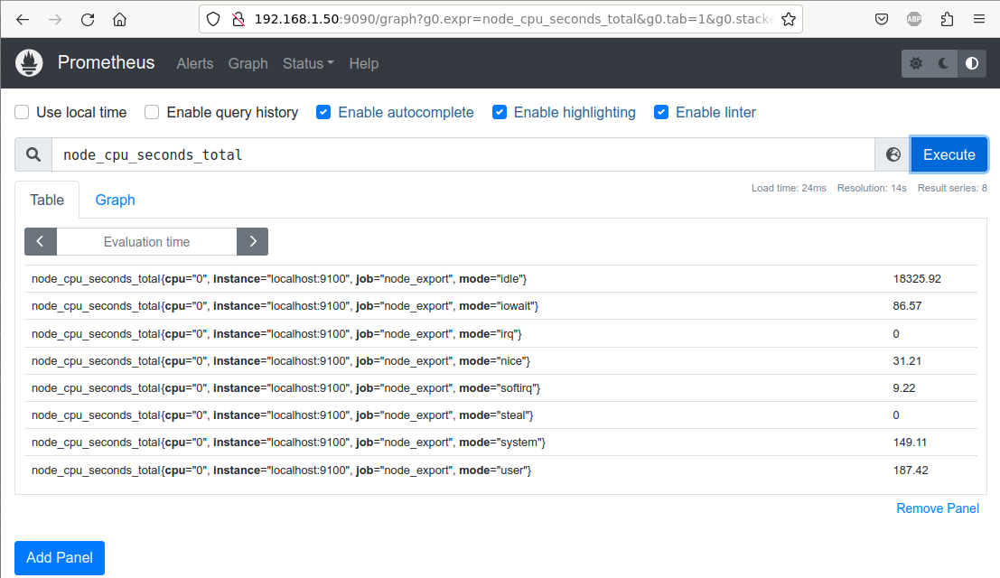
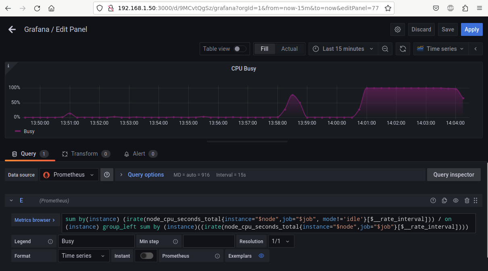

_Запустим скрипт из второго задания:_ \
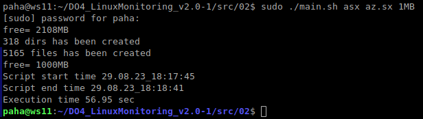

_Посмотрим на нагрузку жесткого диска (место на диске и операции чтения/записи):_
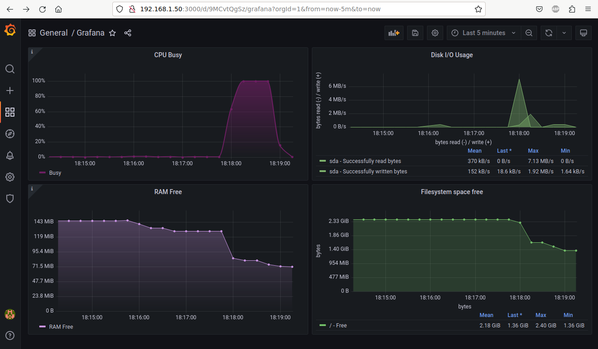

## Stress utility: 

### Установка утилиты
`$ sudo apt install -y stress`

### Запуск утилиты:
`$ stress -c 2 -i 1 -m 1 --vm-bytes 32M -t 10s`

_Результаты работы утилиты в консоли и в Графане_ \
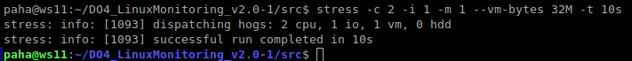

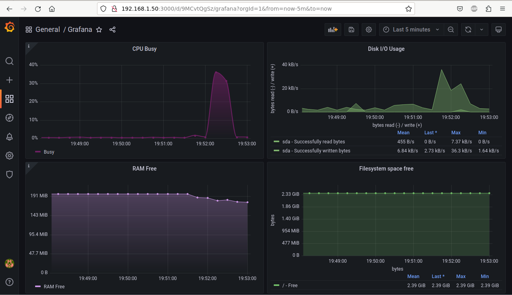
