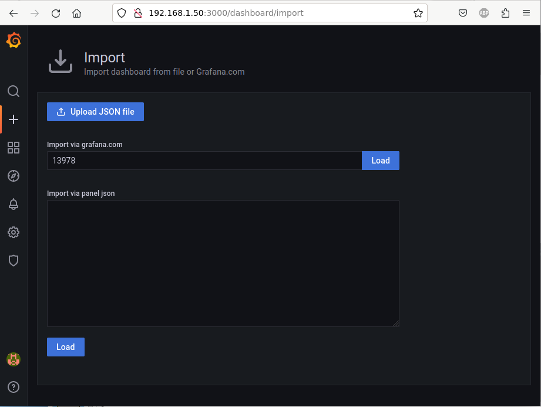
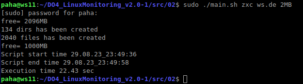
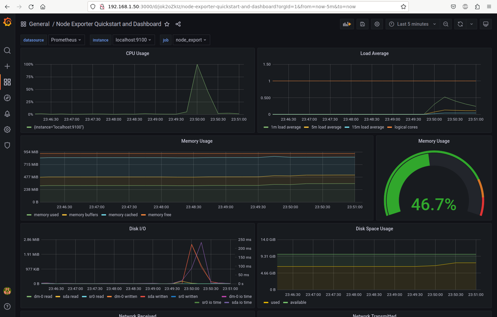
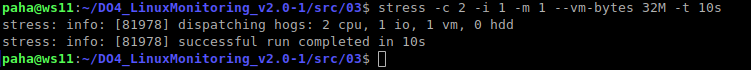
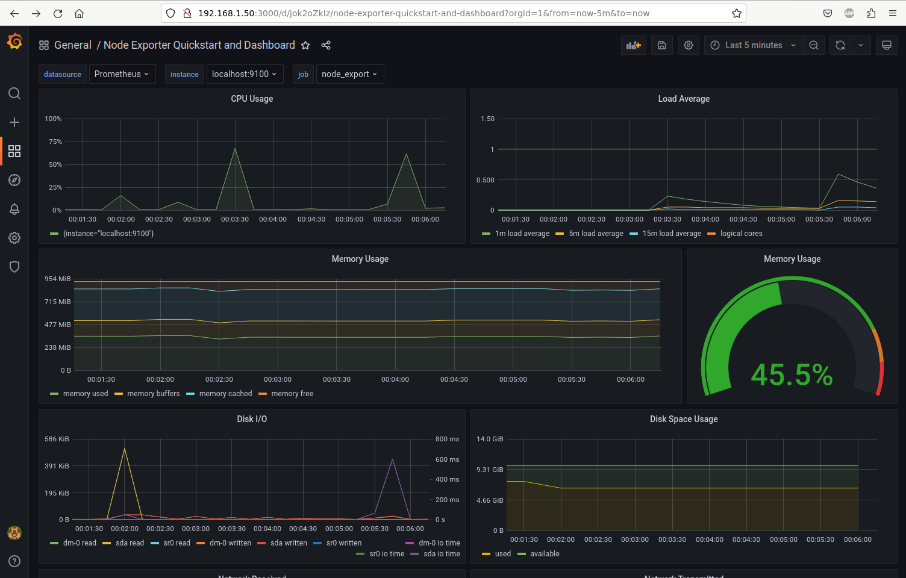
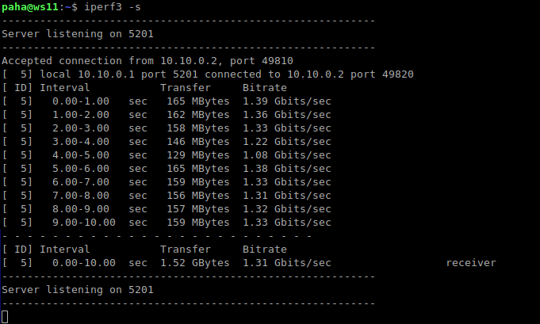
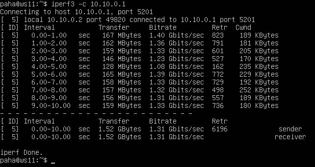
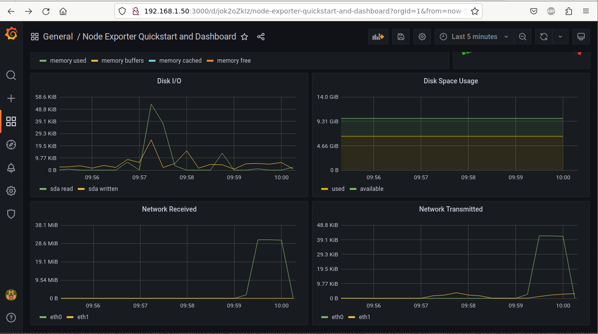

# Использование готового дашборда в Grafana

#### Установим дашборд *Node Exporter Quickstart and Dashboard* с официального сайта **Grafana Labs**. Для этого узнаем на сайте ID дашборда (13978). Далее в веб-интерфейсе Grafana выберем Dashboards -> Browse -> Import. Введем ID, нажмем LOAD, затем IMPORT

#### Запустим скрипт из второго задания и посмотрим рузультатт в Графане:

#### Запустим утилиту stress и посмотрим рузультат в Графане:

#### Запустим ещё одну виртуальную машину, находящуюся в одной сети с текущей. Запустим тест нагрузки сети с помощью утилиты **iperf3**. Посмотрим нагрузку сети в Графане:

