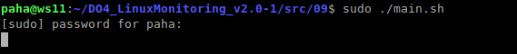

### Установка веб-сервера Apache2
`$ sudo apt install apache2`

### Настройка Apache2

_/etc/apache2/ports.conf_ \


### Перезапуск Apache2
`$ sudo service apache2 restart`

### Настроим Prometheus для связывания его с нашей страничкой:

`$ sudo nano /etc/prometheus/prometheus.yml` 

_Допишем в файл prometheus.yml в раздел scrabe_configs следующие строки:_

```

...

scrabe_configs:

...

  - job_name: "my_export"
    static_configs:
      - targets: ["localhost:80"]
```

## Запустим наш скрипт с правами админа:


_Таргеты в веб-интерфейсе Prometheus:_ \


## Создадим в Grafana новый дашборд с тремя панелями, собирающими информацию с нашей странички

_Дашборд My Dashboard:_ \


## Запустим скрипт из второго задания

_Запуск скрипта:_ \


_Результаты запуска скрипта:_ \


## Утилита Stress

_Запуск утилиты:_ \


_Результаты запуска утилиты:_ \
