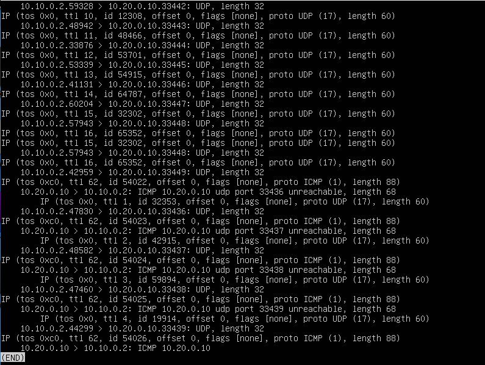
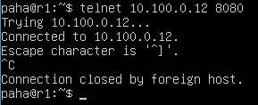

# Сети в Linux

## Part 1. Инструмент **ipcalc**

#### 1.1. Сети и маски

##### 1) адрес сети *192.167.38.54/13*

- Адресом сети у узла 192.167.38.54/13 является 192.160.0.0
> 

##### 2) перевод маски *255.255.255.0* в префиксную и двоичную запись, */15* в обычную и двоичную, *11111111.11111111.11111111.11110000* в обычную и префиксную

- Маска /255.255.255.0 в префиксной записи будет иметь вид /24, а в двоичной 11111111.11111111.11111111.00000000
> 

- Маска /15 в обычной записи имеет вид 255.254.0.0, а в двоичной 11111111.11111110.00000000.00000000
> 

- У маски 11111111.11111111.11111111.11110000 четыре нуля справа. Таким образом 32 - 4 = 28. Префиксная запись имеет вид /28. Обычная запись /255.255.255.240
> 

##### 3) минимальный и максимальный хост в сети *12.167.38.4* при масках: */8*, *11111111.11111111.00000000.00000000*, *255.255.254.0* и */4*

- У сети *12.167.38.4/8* HostMin 12.0.0.1 HostMax 12.255.255.254. У сети *12.167.38.4/16* HostMin 12.167.0.1 HostMax 12.167.255.254. У сети *12.167.38.4/255.255.254.0* HostMin 12.167.38.1 HostMax 12.167.39.254
> 

- У сети *12.167.38.4/4* HostMin 0.0.0.1 HostMax 15.255.255.254
> 

#### 1.2. localhost

##### Определить и записать в отчёт, можно ли обратиться к приложению, работающему на localhost, со следующими IP: *194.34.23.100*, *127.0.0.2*, *127.1.0.1*, *128.0.0.1*

- Можно ли обратиться к приложению, работающему на localhost, со следующими IP: *194.34.23.100* - Нет, *127.0.0.2* - Да
> 

- Можно ли обратиться к приложению, работающему на localhost, со следующими IP: *127.1.0.1* - Да, *128.0.0.1* - Нет
> 

#### 1.3. Диапазоны и сегменты сетей

##### 1) какие из перечисленных IP можно использовать в качестве публичного, а какие только в качестве частных: *10.0.0.45*, *134.43.0.2*, *192.168.4.2*, *172.20.250.4*, *172.0.2.1*, *192.172.0.1*, *172.68.0.2*, *172.16.255.255*, *10.10.10.10*, *192.169.168.1*

- Адреса *10.0.0.45* и *192.168.4.2* можно использовать только в частной сети. Адрес *134.43.0.2* можно использовать в качестве публичного.
> 

- Адрес *172.20.250.4* можно использовать только в частной сети. Адреса *172.0.2.1* и *192.172.0.1* можно использовать в качестве публичного.
> 

- Адрес *172.68.0.2* можно использовать в качестве публичного. Адрес *172.16.255.255* является широковещательным в частной сети. Адрес *10.10.10.10* можно использовать только в частной сети
> 

- Адрес *192.169.168.1* можно использовать в качестве публичного.
> 

##### 2) какие из перечисленных IP адресов шлюза возможны у сети *10.10.0.0/18*: *10.0.0.1*, *10.10.0.2*, *10.10.10.10*, *10.10.100.1*, *10.10.1.255*

- *10.0.0.1* - Нет, *10.10.0.2* - Да, *10.10.10.10* - Да, *10.10.100.1* - Нет, *10.10.1.255* - Да.
> 

## Part 2. Статическая маршрутизация между двумя машинами

- Командой `ip a` посмотрим существующие сетевые интерфейсы у машины ws1.
> 

- Сетевые интерфейсы у ws2.
> 

- Зададим для ws1 настройки сети *192.168.100.10/16* путем редактирования файла *etc/netplan/00-installer-config.yaml*. Применим настройки.
> 

- Для ws2 настройки сети сделаем *172.24.116.8/12* и сразу применим их.
> 

#### 2.1. Добавление статического маршрута вручную

- Добавим статический маршрут от машины ws1 до машины ws2. Пропингуем ws2
> 

- Добавим статический маршрут от машины ws2 до машины ws1. Пропингуем ws1
> 

#### 2.2. Добавление статического маршрута с сохранением

- Добавим статический маршрут от машины ws1 до машины ws2 с помощью файла *etc/netplan/00-installer-config.yaml*. Применим настройки и пропингуем ws2
> 

- Добавим статический маршрут от машины ws2 до машины ws1 с помощью файла *etc/netplan/00-installer-config.yaml*. Применим настройки и пропингуем ws1
> 

## Part 3. Утилита **iperf3**

#### 3.1. Скорость соединения

- Переведем: 8 Mbps в MB/s, 100 MB/s в Kbps, 1 Gbps в Mbps

  - 8 Mbps = 1 MB/s
  - 100 MB/s = 819200 Kbps
  - 1 Gbps = 1024 Mbps

#### 3.2. Утилита **iperf3**

- Измерим скорость соединения между ws1 и ws2. Для этого запустим утилиту **iperf3** на машине ws1 в режиме сервера
> 

- А на машине ws2 запустим утилиту **iperf3**  в режиме соединения с сервером ws1
> 

## Part 4. Сетевой экран

#### 4.1. Утилита **iptables**

- На обоих машинах создадим исполняемый файл */etc/firewall.sh* с правилами утилиты iptables. В них сначала изменим правила по умолчанию для основных цепочек. Потом разрешим входящие пакеты по протоколу tcp для портов 22 и 80. 

- Далее на машине ws1 создадим сначала запрещающее, а потом разрешающее правило к входящим пакетам типа *echo-reply* по протоколу ICMP .  Запустим файл */etc/firewall.sh*
> 

- А на машине ws2 сделаем наоборот, сначала разрешающее, а потом запрещающее правило и тоже запустим файл */etc/firewall.sh*
> 

- Если в цепочке обнаруживается правило, полностью удовлетворяющее проверяемому пакету, действие из этого правила применяется к пакету и остальные правила не проверяются (если действие завершающее).

#### 4.2. Утилита **nmap**

- Пропингуем с машины ws1 машину ws2. Пинг проходит, так как на ws2 первым стоит разрешающее правило для пинга
> 

- Пропингуем с машины ws2 машину ws1. Пинг не проходит, так как на ws1 первым стоит запрещающее правило. Утилитой *nmap* просканируем ws1, она сообщает, что машина работает
> 

## Part 5. Статическая маршрутизация сети

- Поднимем пять виртуальных машин (3 рабочие станции (ws11, ws21, ws22) и 2 роутера (r1, r2))

#### 5.1. Настройка адресов машин

- Настроим сеть на роутере r1. Применим настройки и проверим командой `ip -4 a`
> 

- Настроим сеть на роутере r2. Применим настройки и проверим командой `ip -4 a`
> 

- Настроим сеть на рабочей станции ws11. Применим настройки и проверим командой `ip -4 a`. Пропингуем роутер r1
> 

- Настроим сеть на рабочей станции ws22. Применим настройки и проверим командой `ip -4 a`
> 

- Настроим сеть на рабочей станции ws21. Применим настройки и проверим командой `ip -4 a`. Пропингуем машину ws22
> 

#### 5.2. Включение переадресации IP-адресов.

- Для включения переадресации IP, выполним на роутере r1 команду `sysctl -w net.ipv4.ip_forward=1`. Для включения переадресации на постояноой основе добавим строчку `net.ipv4.ip_forward = 1` в файл */etc/sysctl.conf*
> 

- Тоже проделаем и с роутером r2
> 

#### 5.3. Установка маршрута по-умолчанию

- Настроим маршрут по-умолчанию для рабочей станции ws11. Применим изменения и командой `ip r` проверим, что маршрут добавился.
> 

- Тоже проделаем с машиной ws21
> 

- И с машиной ws22
> 

- Пропингуем с машины ws11 роутер r2.
> 

- На роутере r2 помощью команды `tcpdump -tn -i eth1` проверим, что пинг доходит.
> 

#### 5.4. Добавление статических маршрутов

- Добавим на роутере r1 статический маршрут в сетку *10.20.0.0/26*. Покажем маршруты командой `ip r`
> 

-  Добавим на роутере r2 статический маршрут в сетку *10.10.0.0/18*. Покажем маршруты командой `ip r`
> 

- На машине ws11 запустим следующие команды:
> 

- При наличии двух и более маршрутов выбирается маршрут с самой длинной маской. Предполагается, что такой маршрут более точный.

#### 5.5. Построение списка маршрутизаторов

- На роутере r1 для анализа пакетов запустим команду `sudo tcpdump -tnv -i eth0` 
> 

- На машине ws11 запустим команду `traceroute 10.20.0.10 -q 1` . По умолчанию traceroute отправляет по 3 пакета, но нам это излишне, по-этому добавляем `-q 1` , то-есть отправлять по одному пакету. 
> 

- Вывод команды tcpdump
> 

- Прожолжение вывода команды tcpdump
> 

- На двух скринах выше видно, что от машины ws11 (ip 10.10.0.2) до машины ws21 (ip 10.20.0.10) проходят udp пакеты. TTL первого пакета равно 1, а каждого последующего пакета увеличивается на 1. Далее мы видим, что от роутера r1 (ip 10.10.0.1) до машины ws11 проходит ICMP сообщение time exceeded in-tranzit, то есть время жизни пакета истекло. И потом такое-же сообшение до машины ws11 идет и от роутера r2 (ip 10.100.0.12). Потом мы видим, что от машины ws21 (ip 10.20.0.10) до машины ws11 идут ICMP сообщения udp port unreachable, то есть пакеты дошли до адреса, но наткнулись на неиспользуемый порт. Traceroute принимает ответы от узлов и от целевого адреса и строит по этим данным маршрут. По умолчанию traceroute отправляет по три пакета, чтобы можно было прикинуть их среднее время прохождения.

#### 5.6. Использование протокола **ICMP** при маршрутизации

- Запустим на r1 перехват сетевого трафика, проходящего через eth0, командой`tcpdump -n -i eth0 icmp`
> 

- Пропингуем с ws11 несуществующий IP с помощью команды `ping -c 1 10.30.0.111`
> 

## Part 6. Динамическая настройка IP с помощью **DHCP**

- Настроим конфигурацию службы DHCP на роутере r2. Для этого отредактируем файл */etc/dhcp/dhcpd.conf*
> 

- Укажем адрес DNS-сервера на r2 в файле */etc/resolv.conf* равным *8.8.8.8*. Перезапустим службу DHCP
> 

- На машине ws21 поменяем настройки сетевого интерфейса таким образом, чтобы он получал ip-адрес автоматически
> 

- После перезагрузки машины ws21 проверим командой *ip a* получение ip-адреса. Пропингуем машину ws22
> 

- Настроим конфигурацию службы DHCP на роутере r1. В этом случае жестко привяжем   IP-адрес *10.10.0.2* к MAC-адресу  *10:10:10:10:10:BA*
> 

- Укажем адрес DNS-сервера на r1 в файле */etc/resolv.conf* равным *8.8.8.8*. Перезапустим службу DHCP
> 

- Настроим MAC-адрес у виртуальной машины ws11
> 

- На машине ws11 поменяем настройки сетевого интерфейса таким образом, чтобы он получал ip-адрес автоматически и укажем MAC-адрес сетевого интерфейса eth0. После перезагрузки проверим полученный IP и пропингуем машину ws22
> 

- На машине ws21 запросим обновление IP-адреса. Посмотрим IP до обновления и после
> 

- Опишем, какими опциями *DHCP* сервера пользовались в этом пункте.

  - *dhclient -r* - освобождение текущих IP-адресов и завершение клиента;
  - *dhclient -v* - получение нового IP с выводом информации;

```shell
subnet 10.20.0.0 netmask 255.255.255.192
{
    range 10.10.0.3 10.10.0.50; - диапазон доступных IP адресов
    option routers 10.20.0.1; - адрес шлюза маршрутизатора
    option domain-name-servers 10.20.0.1; - IP адресс DNS-сервера
    deny unknown-clients; - не выдавать адреса неизвестным клиентам
    host ws11
    {
        hardware ethernet 10:10:10:10:10:BA; - MAC-адрес сетевого устройства
        fixed-address: 10.10.0.2; - Жестко прописанный IP
    }
}
```

## Part 7. **NAT**

- На роутере r1 в файле */etc/apache2/ports.conf* изменим строку `Listen 80` на `Listen 0.0.0.0:80`, то есть сделаем веб-сервер Apache2 общедоступным. Запустим Apache2
> 

- Сделаем тоже-самое на машине ws22
> 

- Настроим на роутере r2 файервол следующиим образом:
> 

- Машина ws22 c роутера r1 не пингуется
> 

- Добавим правило для разрешения маршрутизации всех пакетов протокола *ICMP*
> 

- Машина ws22 c роутера r1 стала пинговаться
> 

- включим **SNAT**, а именно маскирование всех локальных ip из локальной сети, находящейся за r2. Включим **DNAT** на 8080 порт роутера r2, те самым добавив к веб-серверу Apache, запущенному на ws22, доступ извне сети. Разрешим уже установленные соединения. Разрешим транзитные tcp пакеты на порт 80 к машинам r1 и ws22.
> 

- Пробуем подключиться к веб-серверу Apache на машине ws22 c роутера r1 используя адрес роутера r2 и порт 8080 
> 

- Пробуем подключиться к веб-серверу Apache на роутере r1 c машины ws22 по порту 80 
> 

## Part 8. Дополнительно. Знакомство с **SSH Tunnels**

- Запустим на r2 фаервол с правилами из части 7, добавив разрешение транзитных пакетов на машину ws11 на порт 2022
> 

- Запустим веб-сервер **Apache** на ws22 на localhost
> 

- На машине ws21 применим *Local TCP forwarding*
> 

- Результат работы предыдущей команды
> 

- Проверка подключения 
> 

- На машине ws22 применим *Remote TCP forwarding*
> 

- Результат работы предыдущей команды
> 

- Проверка подключения 
> 

- Пояснения использованных команд

  - `sudo /etc/firewall.sh` - запуск файрвола. Нам нужно разрешить транзитные пакеты на порт 2022, так как в предыдущих заданиях мы настроили работу ssh-сервера на этот порт.

  - `sudo service apache2 restart` - запуск веб-сервера на ws22. Сервер слушает только localhost

  - `ssh -p 2022 -L 8080:localhost:80 paha@10.20.0.20` - *Local TCP forwarding*, доступ с ws21 к серверу на ws22. Эту команду вводим на ws21. После успешного подключения к SSH-серверу на ws22, на ws21 SSH-клиент начинает слушать порт 8080. При подключении к порту 8080 на ws21, SSH-сервер на ws22 устанавливает соединение с localhost на порт 80 и передает по этому соединению данные, принятые ssh-клиентом на ws21 на порт 8080.

  - `ssh -p 2022 -R 8080:localhost:80 paha@10.10.0.2` - *Remote TCP forwarding*, доступ с ws11 к серверу на ws22. Эту команду вводим на веб-сервере ws22. После успешного подключения, на ws11 SSH-сервер начинает слушать порт 8080. При подключении к порту 8080 на ws11, SSH-клиент на ws22 устанавливает соединение с localhost на порт 80 и передает по этому соединению данные, принятые ssh-сервером на ws11 на порт 8080.

