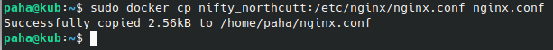

# Simple Docker

## Part 1. Готовый докер

#### Взять официальный докер образ с **nginx** и выкачать его при помощи `docker pull`  
* используем команду `sudo docker pull nginx`  

#### Проверить наличие докер образа через `docker images`  
* используем команду `sudo docker images`  

#### Запустить докер образ через `docker run -d [image_id|repository]`. Проверить, что образ запустился через `docker ps`. Посмотреть информацию о контейнере через `docker inspect [container_id|container_name]`  
* используем команду `sudo docker run -d bc649bab30d1` и проверяем, что образ запустился с помощью команды `sudo docker ps`. Выводим информацию о контейнере командой `sudo docker inspect jovial_mendel`  

#### По выводу команды определить и поместить в отчёт размер контейнера, список замапленных портов и ip контейнера
* используем команду `sudo docker inspect -s jovial_mendel | grep -i sizerw`, чтобы показать размер контейнера в байтах. Командой `sudo docker inspect jovial_mendel | grep -i ipaddress` узнаем ip адрес контейнера (172.17.0.2).  

* Список портов  

#### Остановить докер образ через `docker stop [container_id|container_name]`. Проверить, что образ остановился через `docker ps`
* Остановим докер образ командой `sudo docker stop jovial_mendel` и проверим командой `sudo docker ps`  

#### Запустить докер с портами 80 и 443 в контейнере, замапленными на такие же порты на локальной машине, через команду *run*
* Запустим докер образ командой `sudo docker run -d -p 80:80 -p 443:443 nginx` и проверим порты командой `sudo docker ps`  

#### Проверить, что в браузере по адресу *localhost:80* доступна стартовая страница **nginx**
* Браузер со стартовой страницей nginx  

#### Перезапустить докер контейнер через `docker restart [container_id|container_name]`. Проверить любым способом, что контейнер запустился
* Перезапустим контейнер командой `docker restart charming_sanderson` и проверим командой `sudo docker ps`  

## Part 2. Операции с контейнером

#### Прочитать конфигурационный файл *nginx.conf* внутри докер контейнера через команду *exec*
* Используем команду `sudo docker exec nifty_northcutt cat /etc/nginx/nginx.conf`  

#### Создать на локальной машине файл *nginx.conf*
* Скопируем этот файл из контейнера командой `sudo docker cp nifty_northcutt:/etc/nginx/nginx.conf nginx.conf`  

#### Настроить в нем по пути */status* отдачу страницы статуса сервера **nginx**
* Настроим nginx.conf следующим образом.  

#### Скопировать созданный файл *nginx.conf* внутрь докер образа через команду `docker cp`. Перезапустить **nginx** внутри докер образа через команду *exec*
* Скопируем файл `nginx.conf` обратно и перезапустим `nginx` командой `sudo docker exec nifty_northcutt nginx -s reload`.  

#### Проверить, что по адресу *localhost:80/status* отдается страничка со статусом сервера **nginx**
* Страница по адресу `localhost:80/status`.  

#### Экспортировать контейнер в файл *container.tar* через команду *export*
* Экспортируем контейнер косвндой `sudo docker export -o container.tar nifty_northcutt`.  

#### Остановить контейнер
* Останавливаем контейнер командой `sudo docker stop nifty_northcutt`.  

#### Удалить образ через `docker rmi [image_id|repository]`, не удаляя перед этим контейнеры. Удалить остановленный контейнер
* Удаляем образ с помощью `sudo docker rmi -f nginx`, затем удаляем контейнер командой `sudo docker rm nifty_northcutt`.  

#### Импортировать контейнер обратно через команду *import*. Запустить импортированный контейнер
* Импортируем контейнер командой `sudo docker import -c 'CMD ["nginx", "-g", "daemon off;"]' container.tar nginx` и запускаем его.  

#### Проверить, что по адресу *localhost:80/status* отдается страничка со статусом сервера **nginx**
* Проверяем адрес `localhost:80/status`.  

